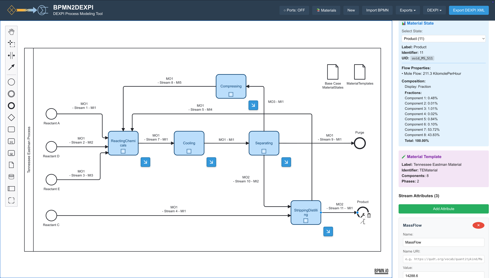

A web-based tool for creating DEXPI 2.0-compliant block flow and process flow diagrams. Model chemical processes visually using BPMN 2.0 and export to DEXPI 2.0 XML — validated against the official DEXPI XML Schema.

## Features

- **Visual Modeling**: Drag-and-drop BPMN 2.0 editor with DEXPI-aware palette
- **DEXPI 2.0 Export**: XSD-validated output against the official DEXPI XML Schema
- **Material Library**: Define materials, compositions, and thermodynamic states
- **Port System**: Typed ports (Material, Energy, Information) with hierarchy support
- **Stream Properties**: Flow rates, compositions, and qualified parameters
- **CLI Tool**: Batch convert BPMN files to DEXPI 2.0 XML from terminal or Python
- **Neo4j Export**: Export process graphs directly to a Neo4j graph database
- **RDL Extension**: Steps not covered by DEXPI can reference external ontologies (ISO 15926, OntoCAPE, company RDLs) via a `customUri`

## Prerequisites

- **Node.js** 18+ (recommended: 20 LTS)
- **npm** 9+
- **xmllint** (for XSD validation — `libxml2-utils` on Linux, `brew install libxml2` on macOS)

## Quick Start

```bash
git clone https://github.com/skhella/bpmn2dexpi.git
cd bpmn2dexpi
npm install
npm run dev        # web app at http://localhost:5173
```

### CLI

```bash
npm run transform input.bpmn output.xml

# or install globally
npm install -g bpmn2dexpi
bpmn2dexpi input.bpmn output.xml
```

### Python

```python
from bpmn2dexpi import transform

transform('input.bpmn', 'output.xml')   # save to file
xml = transform('input.bpmn')           # get as string
```

See [CLI_USAGE.md](./CLI_USAGE.md) for more examples.

## Web Interface

1. Open `http://localhost:5173`
2. Drag process elements from the palette
3. Connect elements with typed flows (Material, Energy, Information)
4. Configure ports and stream properties in the properties panel
5. Export to DEXPI 2.0 XML or Neo4j



## Neo4j Export

1. Click **Export to Neo4j** in the toolbar
2. Enter your connection details (`bolt://localhost:7687` or Aura URI)
3. Click Export

## Architecture

The transformer is a standalone, framework-independent TypeScript module — importable independently of the React frontend:

```
src/transformer/
├── BpmnToDexpiTransformer.ts      # Core BPMN → DEXPI 2.0 transformation
├── DexpiProcessClassRegistry.ts   # Loads Process.xml → authoritative class list
├── DexpiOutputValidator.ts        # XSD + structural validation
├── TransformerLogger.ts           # Warning/error collection
├── types.ts                       # Typed interfaces
└── __tests__/                     # 50 automated tests

dexpi-schema-files/
├── DEXPI_XML_Schema.xsd           # Official DEXPI 2.0 XML Schema
└── Process.xml                    # DEXPI 2.0 Process model (replace to update)
```

## Testing

```bash
npm test              # run all 50 tests
npm run test:watch    # watch mode
npm run test:coverage # with coverage
```

Covers unit tests (transformer logic, class registry, output validation) and an end-to-end integration benchmark on a real-world PFD. The integration suite requires `xmllint` — see Prerequisites.

CI runs on Node.js 18, 20, and 22 via GitHub Actions on every push.

## Based on Research

This tool implements the representation methodology described in:

> Shady Khella, Markus Schichfeld, Erik Esche, Frauke Weichhardt, and Jens-Uwe Repke.
> *Representing DEXPI Process in BPMN 2.0 for Graphical Modeling and Exchange of Block Flow and Process Flow Diagrams* (under review, Digital Chemical Engineering, 2026).

## Technology

- **Frontend**: React 19, TypeScript
- **Diagramming**: [bpmn.io](https://bpmn.io) (bpmn-js)
- **Build**: Vite 7
- **Testing**: Vitest
- **Schema**: [DEXPI 2.0](https://dexpi.gitlab.io/-/Specification)

## License

MIT — see [LICENSE](./LICENSE).

**bpmn-js** is licensed under the bpmn.io License (modified MIT). The bpmn.io watermark must remain visible and unmodified.

**DEXPI Specification** is licensed under CC BY 4.0.

---

*v0.1.0*
